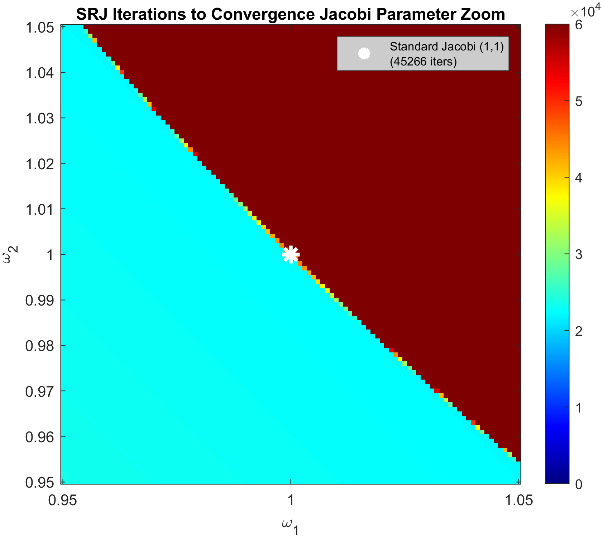

# Analysis of Jacobi Iterative Methods for Solving the Laplace Equation 

## Summary
Developed and optimized a Scheduled Relaxation Jacobi (SRJ) method solver using a coarse-to-fine parameter search. A scan over preliminary parameter values was used to determine regions of convergence/divergence and relative convergence speeds. A minimum is obtained, and a finer scan around the minimum was conducted to determine optimal parameters with higher accuracy. Two iterative scans were conducted, but the program supports an arbitrary amount as one desires. Optimal parameters were found to be $(\omega_1 = 3.4026, \omega_2=0.5859)$, and these were compared visually with the theoretical optimal parameters. A full scan over the range $0 \leq \omega_1,\omega_2 \leq 4$ is also conducted to determine what convergence looks like for alternating over-relaxed, or alternating under-relaxed parameters. A full analysis can be found at XXXXX

## Results

 

 

 
$$
\nabla^2 u= u_{xx}+u_{yy}=0
$$

$$
u(0,y)=0
$$

$$
u(2\pi,y)=0
$$

$$
u(x,0)=sin(2x)+sin(5x)+sin(7x)
$$

$$
u(x,2\pi)=0
$$

## Discretization of Grid
The grid will be discretized into a $N_x \times N_y$ mesh with $\Delta x = (2\pi)/{N_x}$, and $\Delta y = (2\pi)/{N_y}$ spacing. Moreover, variable values will be placed at cell vertices. This requirement means that, in the process of discretization, single points must be added at the beginning and end of the indexed grid to account for boundary conditions.

In our MATLAB implementation, the grid will be represented by a $(N_x+2) \times (N_y+2)$ array, where the first and last rows/columns encode boundary conditions. This geometry requires that the x and y axes range from $-dx$ to $Lx+dx$, and $-dy$ to $Ly+dy$, respectively. We represent an index space and grid space as follows:

$$
\mathcal{I}=\left\\{(i,j)\mid 1 \leq i \leq N_x+2,1\leq j \leq N_y+2\right\\}
$$

$$
\mathcal{D}_g=\left\\{((i-1)\Delta x,(j-1)\Delta y)|(i,j)\in\mathcal{I}\right\\} 
$$

Based on these assumptions, boundary values and interior points may be related using the following conditions: 

### For Left Boundary:

$$
u_{1,j} = -u_{2,j}
$$

### For Right Boundary:

$$
u_{N_x+2,j} = -u_{N_x+1, j}
$$

### For Top Boundary

$$
u_{i, N_y+2} = -u_{i,N_y+1}
$$

### For Bottom Boundary

$$
u_{i,1}=2(sin(2x_i)+sin(5x_i)+sin(7x_i))-u_{i,2}
$$

## Point Jacobi Implementation

Using a second-order central finite difference method, the problem may be discretized as follows:

$$
\frac{u_{i+1,j}-2_{i,j}+u_{i-1,j}}{\Delta x^2} +
\frac{u_{i,j+1}-2_{i,j}+u_{i,j-1}}{\Delta y^2}=0
$$

This approximation has error $O(\Delta x,\Delta y)$. We implement the Point Jacobi method using a $100 \times 100$ mesh. This means $N_x=N_y=100$ with $\Delta x = \Delta y = (2\pi)/100$. This can be implemented with the following finite difference equation:

$$
u_{i,j}^{k+1}=\frac{1}{4}\left(u_{i+1,j}^{k}+u_{i-i,j}^{k}+u_{i,j+1}^{k}+u_{i,j-1}^{k}\right) $$

This will be 'time-marched' until convergence is reached. Convergence over the grid will be tracked using the following residual: 

$$
r^k = \sum_{(i,j) \in\mathcal{I}} \left|\frac{u_{i+1,j}-2_{i,j}+u_{i-1,j}}{\Delta x^2} + \frac{u_{i,j+1}-2_{i,j}+u_{i,j-1}}{\Delta y^2}\right| 
$$

The convergence criteria $r^k \leq 10^-5$ will be used. To speed up the search algorithm utilized, the residual will only be checked at certain iteration frequencies.

## Scheduled Relaxation Jacobi (SRJ) Method Implementation and Optimization 
The second method we will implement is the Scheduled Relaxation Jacobi (SRJ) Method. While the Jacobi method will always converge (provided the initial matrix is diagonally dominant), reaching convergence can be slow due to eigenvalues of the iteration matrix being close to 1. We implement a relaxation method by first utilizing the Jacobi method to calculate an intermediate value, and then taking a weighted average with the old value using a relaxation parameter $\omega$. For $\omega<1$, low-frequency errors are reduced, but high-frequency errors are introduced. For $\omega>1$, those high-frequency errors are dampened. The SRJ method aims to obtain the benefits of both methods by alternating at each iteration.

This can be represented by the following condition: 

### If k is even:

$$
u_{i,j}^{k+1}=(\omega_1-1)u_{i,j}^{k}+\omega_1\left(\frac{u_{i+1,j}^{k}+u_{i-i,j}^{k}+u_{i,j+1}^{k}+u_{i,j-1}^{k}}{4}\right) 
$$

### If k is odd:

$$
u_{i,j}^{k+1}=(\omega_2-1)u_{i,j}^{k}+\omega_2\left(\frac{u_{i+1,j}^{k}+u_{i-i,j}^{k}+u_{i,j+1}^{k}+u_{i,j-1}^{k}}{4}\right) 
$$

The literature states that $\omega_1=3.414213$, and $\omega_2=0.585786$ are the optimal parameters to reach convergence the fastest. We seek to characterize the convergence behavior over a range of parameter values to gain more information on how parameter choices can affect convergence speed. We will loop between varying combinations of both values of omega such that $0 \le \omega_2 \le 1$, and $1 \leq \omega_1 \leq 4$. We will evaluate the convergence speed at parameter spacings of $\Delta \omega = 0.01$. This is a broad, but semi-coarse search to gauge convergence regions of the parameter space. An ideal value of $\omega_1$ and $\omega_2$ will then be found by determining the minimum convergence parameters in the data. A finer search will be conducted around this value by creating a window of appropriate width around the minimal parameters and searching with a smaller spacing $\Delta \omega=0.001$. This scan is reiteratively conducted until an ideal accuracy of $(\omega_1,\omega_2)$ is obtained.

### First Search (Scan #1) Conducted on $\Omega_1^1 \times \Omega_2^1$ 

$$
\Omega_1^1 = \left\\{a\Delta \omega^1 \mid a \in \mathbb{N}, a\Delta \omega^1 \in [1,4]\right\\} 
$$

$$
\Omega_2^1 = \left\\{b\Delta \omega^1 \mid b \in \mathbb{N}, b\Delta \omega^1 \in [0,1]\right\\} 
$$

Searching this will yield $\omega_1^1$ and $\omega_2^1$. These will be used to search at later denser grids. For arbitrary iteration number $d$, the following grids are searched:

### Arbitrary Search (Scan #d) conducted on $\Omega_1^d \times \Omega_2^d$ 

$$
\Omega_1^d = \left\\{a\Delta \omega^d \mid a \in \mathbb{N},a\Delta \omega^d \in
[\omega_1^{d-1}-10W\Delta\omega^d,\omega_1^{d-1}+10W\Delta\omega^d]\right\\} $$

$$
\Omega_2^d = \left\\{b\Delta \omega^d \mid b \in \mathbb{N}, b\Delta \omega^d \in
[\omega_2^{d-1}-10W\Delta\omega^d,\omega_2^{d-1}+10W\Delta\omega^d]\right\\} 
$$

Here, $W$ represents the window size, and superscripts notate the scan number. Residuals are checked at varying frequencies depending on scan number to ensure faster convergence.

The initial search range provided does not show the full picture for an arbitrary dual parameter method. We have not considered methods that alternate between two under-relaxation parameters or two over-relaxation parameters. Moreover, it would be beneficial to factor in the traditional over-relaxation method (where $\omega_1=\omega_2$). To develop a full characterization of dual parameter methods, a final scan for $0 \leq \omega_1,\omega_2 \leq 4$ where $\Delta \omega_1=\Delta \omega_2=0.01$ will be conducted to determine how an arbitrary dual parameter search behaves

We will also conduct a fine search around $\omega_2=\omega_2=1$. This search intends to determine how small changes in the relaxation parameter around the initial Jacobi method can affect convergence behavior.

Solver methods are written for MATLAB Mex conversion and utilize practices that are ideal for C code. MATLAB Parallel Computing Toolbox is used for faster searches, as multiple parameter combinations can be searched at once. MATLAB code for implementation is provided in the appendix, and associated plots and generated data are stored in subfolders. The results are as follows

# Results

 
 
 
The parameter search produced clear visualizations of which omega combinations are convergent and which are divergent. There is a convergent region which tapers off asymmetrically (around $\omega_=0.5$) to a vertex with a minimum number of iterations at $(3.36,0.58)$.

Convergence speeds display a clear gradient. There is a local maximum at (1,0), and iteration counts decrease as $\omega_1$ and $\omega_2$ increase. The number of iterations appears to decrease to a minimum as the parameter pair approaches the vertex. The standard Jacobi method at (1,1) converges with 45266 iterations, higher compared to the optimal SRJ parameter combination. Higher resolution scans around the minimum vertex reveal more about the boundary between the fastest convergent region and the divergent region. The scans show that there is a somewhat gradual gradient towards higher iterations as $\omega_2$ decreases out of the convergent region. The scans show a sudden change from low iteration convergent to divergent as $\omega_2$ increases out of the convergent region. The calculated value of the optimal SRJ parameters after Scan 3 is (3.4026,0.5859).

 
The Jacobi Method, SRJ method with optimized coefficients, and the SRJ method with theoretical optimal coefficients all converged. The optimized SRJ method converged the fastest. The theoretical optimal SRJ method converged second fastest, initially underperforming relative to the other two methods, and then overcoming the Jacobi method. The Jacobi method performed the slowest, with residuals slowly decaying. All residuals demonstrate an exponential decay as shown by the semilog plot. However, the Optimized SRJ method decays slightly slower as its residual approaches $10^-4$.

 
The full parameter range scan reveals a convergence graph symmetric around $\omega_1=\omega_2$. The original sharp blue convergence region is mirrored for the case where $\omega_2$ is over-relaxed, and $\omega_1$ is under-relaxed. The region where both parameters are over-relaxed is divergent, while the region where both parameters are under-relaxed shows convergence, but at significantly higher iterations. Certain parameter pairs with very low under-relaxed values will fully diverge.

 
The fine search around the original Jacobi parameters at (1,1) reveals a fast convergent region averaging ~2.3E4 to the bottom left of the point (1,1). The Jacobi parameters lie on the boundary between convergent and divergent behavior.

# Discussion
The most surprising features about the convergence plots are how the convergence/divergence of a parameter pair is very sensitive to small changes in the parameters. If the optimal parameter predicted by the scan was adjusted on the $\omega_2$ axis by even $\pm 0.005$, the model would diverge. Increasing $\omega_1$ by $0.01$ also puts the model in the divergent range. What's also surprising is how the theoretical values of omega converge in a higher number of iterations relative to the number of iterations predicted by the scan method. Moreover, the theoretical pair is right near the vertex, while the optimized values of omega predict the true convergence minimum to be closer inwards and on the northward edge of convergence. The plot shows that even a benign rounding error of the theoretical $\omega_2$ estimate, changing 0.585906 to 0.59, would cause the simulation to diverge. These differences can most probably be attributed to the choice of boundary conditions used in this study. The theoretical values of $\omega_1$ and $\omega_2$ are based on an unoptimal scenario where all wavenumbers are excited. Here, our boundary conditions only affect certain wavenumbers. Since optimal parameters vary based on boundary conditions, there are merits to an exhaustive search in determining the optimal omega. The convergence plots provide useful heuristics for determining appropriate parameter values to use in a situation. For example, if the true optimal parameters are not known, the user could note that variation in $\omega_2$ is punished while variation in $\omega_1$ (provided it is close enough to the vertex) is not.

Moreover, parameter choices do not have to be fully in the convergent region to reap optimization benefits. Safer parameter choices can be made to avoid divergence, while also retaining the faster convergence benefits of a Scheduled Relaxation Method.

The residual graphs show clearer convergence trends in terms of residuals for each method. The sudden taper in residual drop for the Optimized SRJ method does not have an obvious explanation. The linear trend in residual count suggests that the residuals decay exponentially.

The full parameter range scan reveals a beautiful symmetric plot, where the sharp convergent point re-emerges on the top left part of the plot.

Clearly, one can choose $\omega_2$ to be an over-relaxation parameter, and $\omega_1$ to be an under-relaxation parameter if they wish. The same convergence implications can be deduced. The plots show that, for a two-parameter setup, the _only_ parameters that have iteration minimizing properties are ones where one parameter over-relaxes, and one parameter under-relaxes. A combination of over-relaxing parameters leads to divergence, while a combination of under-relaxing parameters, which leads to convergence, still demonstrates high iteration counts.

Moreover, they still underperform the standard Jacobi method. The plot reveals a key insight: for $0 \leq \omega_1,\omega_2 \leq 2$, the iteration number graph appears to have level curves defined by $\omega_1+\omega_2=C$ for arbitrary C. In essence, for particular parameter choices, the iteration count is entirely characterized by the value of C. More analytical work has to be done to determine if this is truly the case for all parameter choices, and why.

The zoom around the Jacobi plot reveals something interesting. The choice of $(1,1)$ is placed right at the boundary between convergent and divergent methods in the omega space. This is something that is not immediately obvious. If the user opted for an Overrelaxed Jacobi method, even marginally with a relaxation factor of $\omega=0.95$, they would immediately receive convergence in half of the iterations that Jacobi requires. This is a very powerful result, and suggests that any type of under-relaxation method is beneficial for the application of the Jacobi Method.

# Conclusion

An Optimal Scheduled Relaxation Jacobi method parameter finding algorithm was developed for the Laplace Equation. High-quality visualizations of convergence for varying parameter values were obtained. A scan method was utilized to determine the optimal parameter values for simulation, and residual histories were compared across the Jacobi method, theoretical parameter value simulations, and optimized parameter value simulations. The plots obtained were used to reveal how parameter values can be strategically chosen to obtain faster convergence results. These results suggest that even standard relaxation methods can significantly cut down on iteration count.
